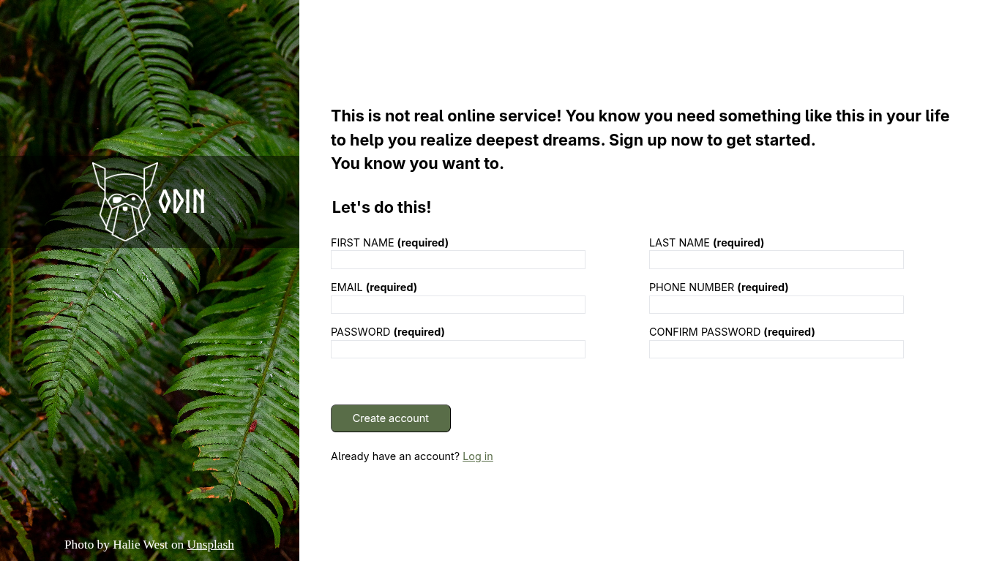

# Sign-up form

This project is intended to give you a chance to flex some of the new items you’ve been absorbing over the past few lessons. This time it’s a sign-up form for an imaginary service.

# Table of contents

- [Preview](#preview)
- [Live](#live)
- [Tools Used](#tools-used)

# Preview

# Live

[Live](https://wenardken57.github.io/Sign-up-form/)

# Tools used

- HTML
- CSS
